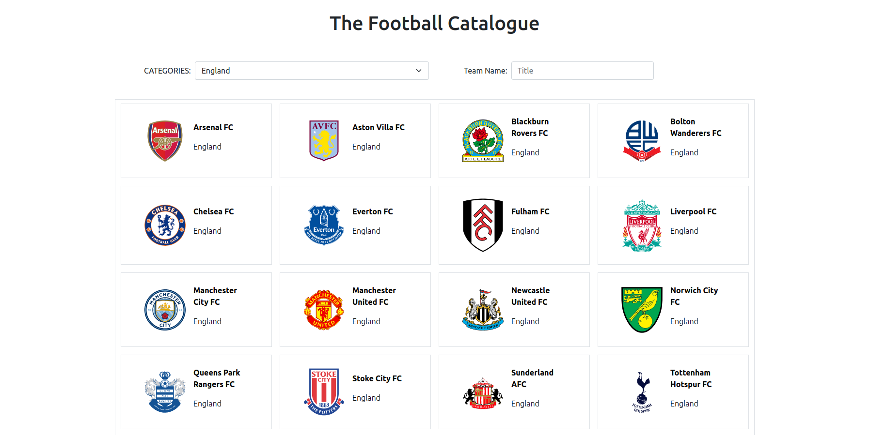
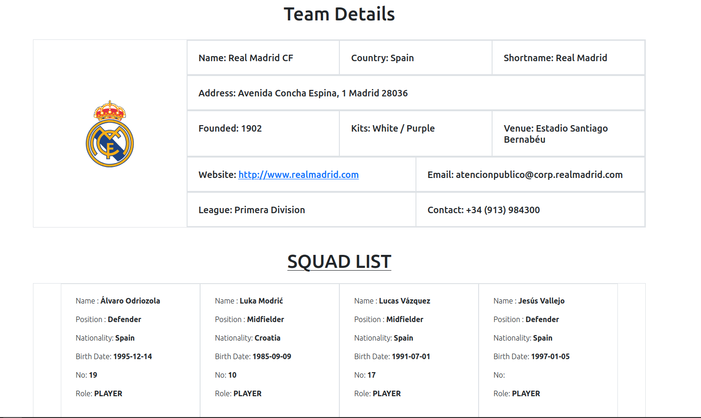

# Catalogue Of Statistics

The Football Catalogue is a catalogue of top football teams across the world which can be filtered and browsed to get details of the club like Squad, contact information etc. Built using React & Redux.

## The Football Catalogue screenshot

## Built With

- npm
- React
- React-DOM
- Redux
- CSS
- JSX

## Getting Started

Get the Api Key

- Go to `https://www.football-data.org/client/register`
- Sign up and get your free API key
- Create a .env file the root directory
- In the file `REACT_APP_KEY = YOUR API KEY` paste this line and replace `YOUR API KEY`text with the received key

To set up a local copy of the project

- `git clone git@github.com:akshay-narkar/Catalogue-of-Statistics.git`
- `cd final-branch`
- `git pull origin final-branch`

If you want to repack the file

- Run `npm install` on the terminal to install dependancies
- Run `npm run build` to bundle the files in the src folder & product ouput in dist folder
- Run `npm run start` to check live server

## Testing

- Jest Testing Framework has been used to test the Redux actions and reducers.
- Main React components have been tested with Snapshot testing.

- Run `npm run test` to run the tests

## Live Link of the project

[Live-Project](https://the-football-catalogue.herokuapp.com/)

## Author

👤 **Akshay Narkar**

- Github: [@akshay-narkar](https://github.com/akshay-narkar)
- Twitter: [Akshay](https://www.twitter.com/akidoit)
- Linkedin: [Akshay Narkar](https://www.linkedin.com/in/akshaynarkar25/)

## 🤝 Contributing

Contributions, issues, and feature requests are welcome!

## Show your support

Give a ⭐️ if you like this project!

## Acknowledgments

## 📝 License

This project is [MIT](LICENSE) licensed.
